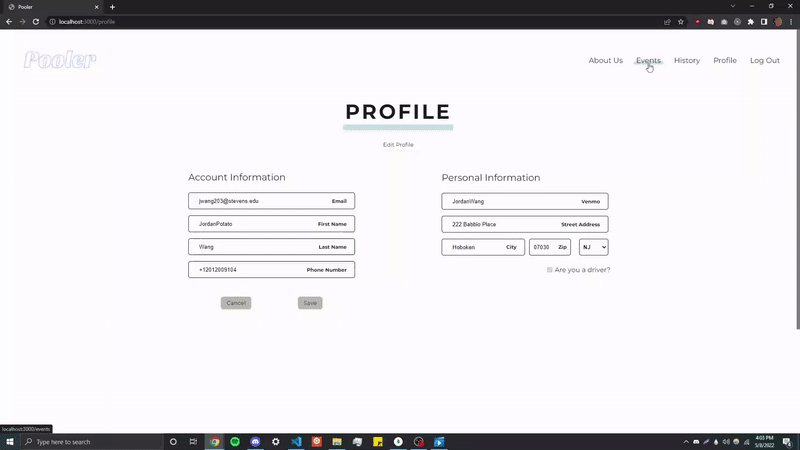

# Pooler

This website acts as a more intuitive and user friendly way to organize car trips to destinations. We expedite the car pooling process through our application by letting the user view what trips are happening and when. When they click on these trips, they will be able to see who is able to drive and who currently has seats in their car, along with all the cars going on this trip. The user will be able to sign in and add themselves to cars, or add their own cars and view various information about the drivers.

Currently, most clubs use Google Sheets or Excel documents to handle carpooling, and we hope to replace this and streamline the carpooling process. The purpose of this application is to help organize carpooling amongst organizations and groups of people and provide more useful information during these trips.

  

## Dynamic History Page w/ Event Details

  

## Dynamic Events View

  

## Getting started

Refer to the gettingstarted.txt file which documents all necessary steps to get this app running on your local computer.
